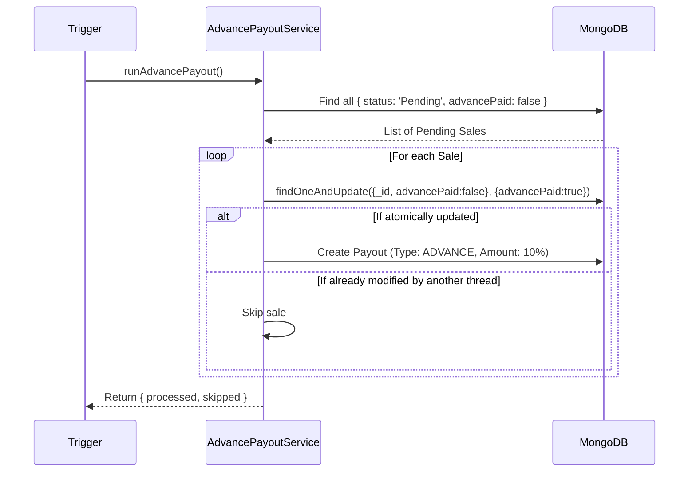
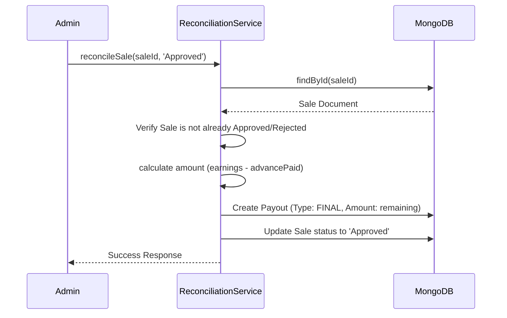
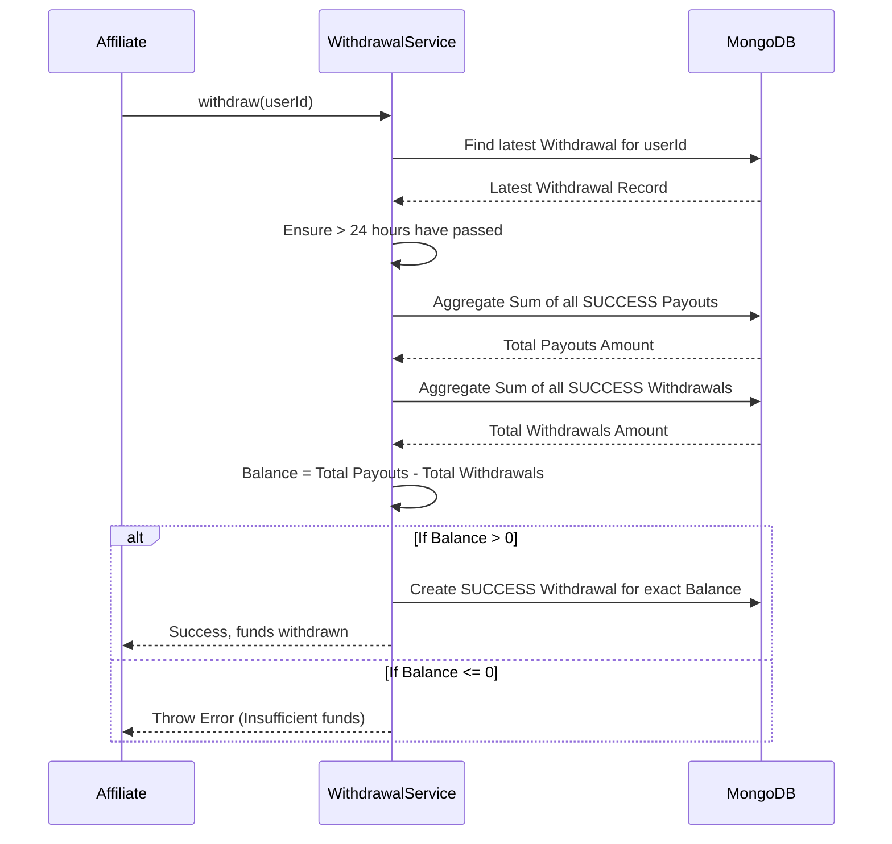

# Low Level Design (LLD)

## System Overview
The Faym User Payout Management System handles high-stakes financial data related to affiliate payouts. As such, the system is designed to be highly reliable, consistent, and resilient against race conditions. It achieves this by strictly adhering to a layered architectural pattern and maintaining immutable transaction records.

## Component Responsibilities

1. **Routes Layer**: Maps HTTP endpoints to specific Controller functions.
2. **Controller Layer**: Responsible for extracting data from the HTTP Request (req.body, req.params), invoking the appropriate Service, handling custom error mapping to standard HTTP status codes (e.g., 400, 404, 409), and formatting the JSON response.
3. **Service Layer**: The brain of the application. Enforces business rules (e.g., 24-hour withdrawal cooldowns, calculating advance percentages, idempotency checks) and interacts directly with Models.
4. **Model Layer (Mongoose)**: Defines the data schema, sets constraints, enforces uniqueness, and establishes database indexes to optimize query performance.

---

## Service Layer Design

### `SaleService`
* **Responsibility**: Manages the lifecycle inception of a sale.
* **Logic**: Validates that earnings are non-negative, ensures the user exists, and persists a new Sale initialized in a `Pending` state with no advance paid.

### `AdvancePayoutService`
* **Responsibility**: Automates the disbursement of the initial 10% commission.
* **Logic**: Polls the database for sales where `status === 'Pending'` and `advancePaid === false`. It strictly bypasses non-profitable sales. Uses atomic operations to mark sales as paid while simultaneously generating the Payout records.

### `ReconciliationService`
* **Responsibility**: Processes the final determination of a sale.
* **Logic**: Acts as a state machine ensuring a sale can only be transitioned *once* to `Approved` or `Rejected`. 
  * If **Approved**: Computes the remaining balance (`earnings - advanceAmount`) and creates a `FINAL` payout.
  * If **Rejected**: Claws back the advance by creating an `ADJUSTMENT` payout for `-advanceAmount`.

### `WithdrawalService`
* **Responsibility**: Calculates liquidity and safely processes user withdrawals.
* **Logic**: Prevents spamming by checking the latest withdrawal timestamp (24-hour limit). Dynamically calculates the "Available Balance" using MongoDB `$aggregate` pipelines. Creates a Withdrawal ledger entry if funds are sufficient.

---

## Flow Explanations & Sequence Diagrams

### 1. Advance Payout Flow
This flow is typically triggered by a scheduled cron job (or an admin API trigger). It must guarantee that an advance is paid exactly once per sale.

### 2. Reconciliation Flow
Approving or rejecting a sale determines the affiliate's final take-home amount.

### 3. Withdrawal Flow
Users request to cash out their available funds.

---

## Explain Design Decisions

### Separate `Payout` Collection
Rather than embedding payout information into the `User` or `Sale` models, Payouts exist in a dedicated collection. This allows for immutable ledgering. If an advance is paid, a final payout is made, or an adjustment is required, they are inserted as individual chronological records. This provides absolute financial traceability and simplifies balance aggregation.

### Idempotency Handling
In `AdvancePayoutService`, we use `findOneAndUpdate` with the condition `advancePaid: false` instead of a standard `save()`. This protects against concurrency issues (e.g., if two automated jobs fire at the same millisecond). Only the thread that successfully mutates `advancePaid` from `false` to `true` will issue the payout.

### Layered Architecture
The system prevents Controllers from talking directly to Mongoose models. By routing logic strictly through Services, we ensure that complex workflows (like Withdrawal validations and Balance calculations) are completely decoupled from HTTP protocols. This makes testing easier and allows multiple interfaces (e.g., REST API, Cron Job, GraphQL) to utilize the exact same business logic safely.
