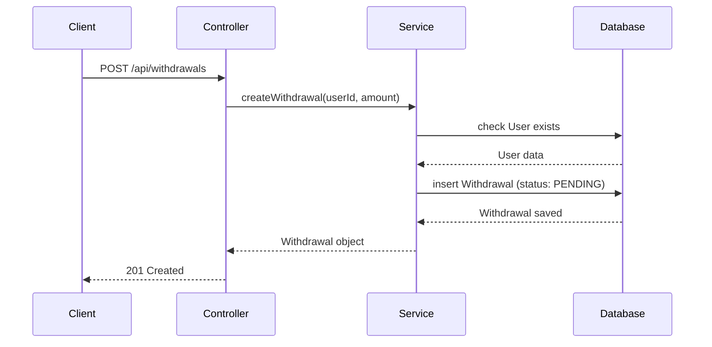
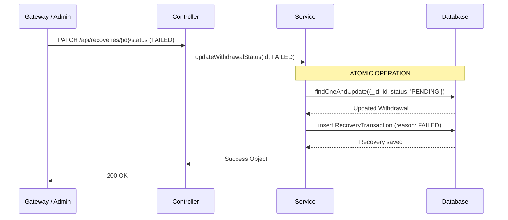

# Low-Level Design (LLD)

## System Overview
The Failed Payout Recovery System is built using a classic 3-tier Layered Architecture (Controller -> Service -> Model). The primary objective is to maintain financial integrity when external payment gateways report failures.

## Component Responsibilities

1. **Controllers** (`withdrawalController`, `recoveryController`):
   - Parse HTTP requests.
   - Route traffic to the appropriate service.
   - Format standard JSON responses (`{ success, message, data }`).
   - Map domain errors to proper HTTP status codes (`400`, `404`, `409`, `500`).

2. **Services** (`WithdrawalService`, `RecoveryService`):
   - Execute all business rules.
   - Handle database transactions and atomic operations.
   - Completely agnostic to HTTP objects (req/res).

3. **Models** (`User`, `Withdrawal`, `RecoveryTransaction`):
   - Define data schemas, default values, and Enums.
   - Enforce database-level validation (e.g., `min: 0` for amounts).

## Withdrawal Lifecycle
1. User requests a withdrawal via `WithdrawalService.createWithdrawal()`.
2. The `Withdrawal` document is created with a `PENDING` state.
3. A payment gateway attempts to process the funds (external step).
4. The system is notified of the result via `RecoveryService.updateWithdrawalStatus()`.

## Recovery Workflow
If the status update evaluates to `FAILED`, `REJECTED`, or `CANCELLED`, the system must:
1. Update the original `Withdrawal` status to halt further processing.
2. Generate an immutable `RecoveryTransaction` to track the failure reason and amount for financial reconciliation.

## Sequence Diagrams

### 1. Withdrawal Creation

### 2. Recovery Processing (Atomic Flow)

## Idempotency Strategy
Idempotency is the most critical aspect of this system. If a webhook triggers twice, we cannot create duplicate recovery transactions.
- **Implementation**: Instead of fetching the record, modifying it, and saving it (`read-modify-write`), the system uses MongoDB's atomic `findOneAndUpdate`.
- **Query**: `{ _id: withdrawalId, status: 'PENDING' }`
- **Result**: Only the very first request will successfully match the `PENDING` state and perform the update. All subsequent concurrent requests will fail to match the query and throw a safe `409 Conflict` error.

## Trade-offs
### Why is `RecoveryTransaction` a separate collection?
**Alternative**: Embed an array of `recoveryAttempts` inside the `Withdrawal` document.
**Trade-off**: Embedding would save a database round-trip. However, creating a separate collection is highly preferred for financial ledgers because:
1. **Query Performance**: The finance team often needs to query *all* failed recoveries over a month. Searching a dedicated collection is vastly faster than unwinding millions of embedded arrays.
2. **Immutability**: A separate collection acts as an append-only ledger, which is a standard requirement for financial auditing.
